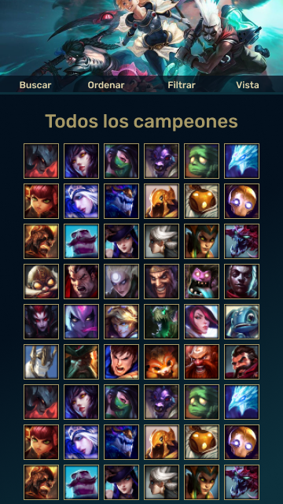
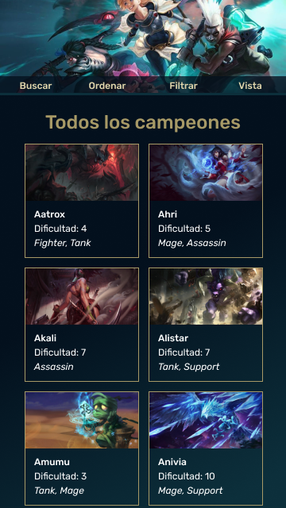
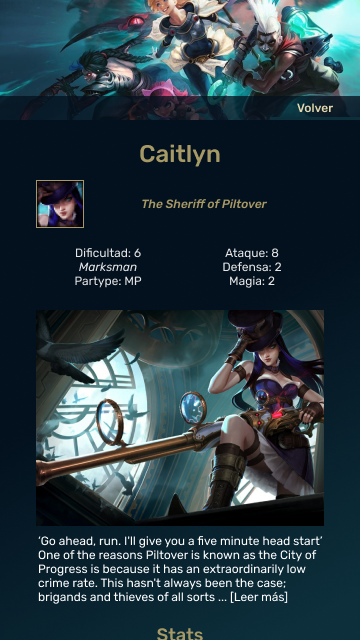
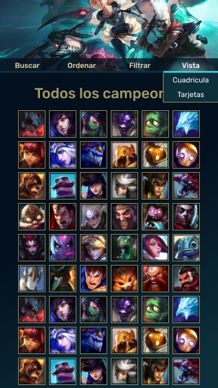

# Data Lovers

En este proyecto elaboramos una pagina que muestra información tomada de un archivo con objetos javaScript, en este caso de los campeones de League of Legends, un juego multijugador online de tipo MOBA.
Esta web muestra información resumida y detallada de los campeones, da la opción de filtrarlos por dificultad y/o rol, ordenar selecciones en orden Alfbético, por Dificultad, por otros parametros como Ataque, Defensa o Magia, o por Rol y buscar campeones utilizando palabras clave.  

[Web](https://dsandovalm.github.io/BOG002-data-lovers/src/index.html)

## Decisiones de diseño

## Usuario

Los principales usuarios de esta aplicación son jugadores nuevos de League of Legends que quieren aprender más sobre los campeones del juego.

Un problema al que se enfrentan es el desconocimiento de los campeones que hay disponibles, el no saber cual elegir para empezar o que habilidades tiene el campeón que han elegido.

### Historias de Usuario

**Historia de Usuario 1**: Yo como usuario quiero ver en la página de inicio el perfil con los datos más importantes de los campeones del juego.

En esta historia es necesario definir los datos que contienen los perfiles reducidos, una vista con ellos y una vista de perfiles detallados. Se crearon las funciones show y details en el _main_, ambas funciones interactuando con el DOM por lo que aún no se ha utilizado el archivo _data_.

**Historia de Usuario 2**: Soy un jugador nuevo y quiero ver descripciones sobre que trata el juego y como se juega para poder jugar con mis amigos o familia.

En esta historia se crea una pagina auxiliar llamada _help.html_ esta no tiene menú, unicamente un enlace para volver al _index_.

**Historia de Usuario 3**: Yo como usuario quiero poder pasar entre vista de cuadricula y la vista de perfiles con información más detallada para encontrar personajes que recuerde por su icono porque asi es como aparecen en el juego.

En esta historia se modifica la función _show_ haciendo que se diferencie su comportamiento cuando la vista es de cuadricula y cuando es de tarjetas. Además de añadir los listeners en los respectivos botones.

**Historia de Usuario 4**: Yo como usuario quiero buscar un dato especifico y que me muestre los perfiles resumidos de todos los campeones que cumplan con esa característica para filtrar los campeones que mejor se adaptan a lo que necesito.

Esta historia requiere utilizar el archivo _data_, creando la función _searchData_ que busca coincidencias entre las palabras de los atributos de los campeones.

**Historia de Usuario 5**: Yo como usuario quiero ordenar los campeones por parametros como su dificultad u otras caracteristicas especificas para saber cuales son los mejores o peores campeones según mi interes.

En esta historia se crea la función _sortData_ que ordena los campeones por un criterio dado.

**Historia de Usuario 6**: Yo quiero que cuando se cargue una gran cantidad de personajes no se muestren todos de una vez sino por paginas con cantidades más reducidas y se permita navegar entre ellas para facilitar la visualización de esta información.

En esta historia se modifica la función show para que no muestre todos los campeones, tambien se añadieron variables globales en _main_ como la pagina actual y el número de campeones por pagina y se añade una sección con el control de la navegación entre páginas. 

## Interfaz

El diseño de esta aplicación está pensado a partir del diseño de las interfaces del juego, tomando su gama de colores y estilo.

### Prototipos de baja Fidelidad

#### Celular
  

#### Escritorio

<!-- 

 -->

### Prototipos de alta Fidelidad

#### Celular

   

