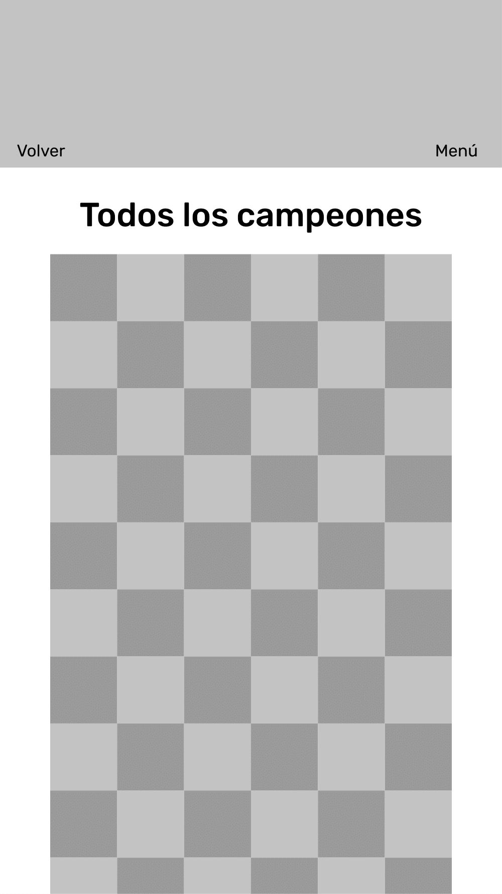
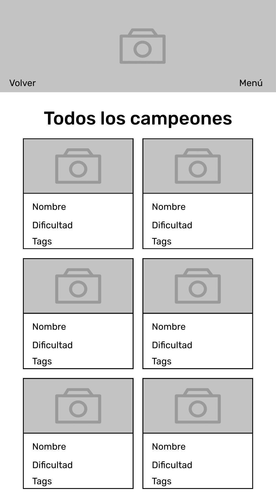
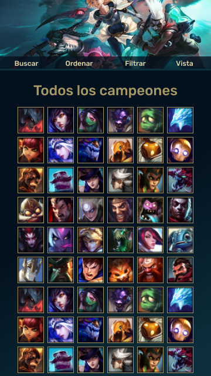
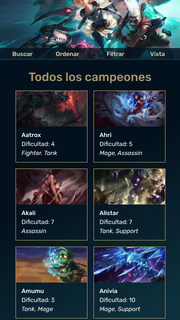
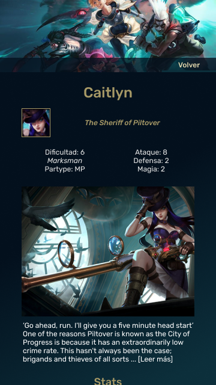
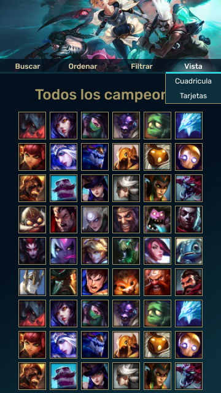

# Data Lovers

[Web](https://dsandovalm.github.io/BOG002-data-lovers/src/index.html)

## Decisiones de diseño

## Usuario

Los principales usuarios de esta aplicación son jugadores nuevos de League of Legends que quieren aprender más sobre los campeones del juego.

Un problema al que se enfrentan es el desconocimiento de los campeones que hay disponibles, el no saber cual elegir para empezar o que habilidades tiene el campeón que han elegido.

### Historias de Usuario

**Historia de Usuario 1**: Yo como usuario quiero ver en la página de inicio el perfil con los datos más importantes de los campeones del juego.

En esta historia es necesario definir los datos que contienen los perfiles reducidos, una vista con ellos y una vista de perfiles detallados.

## Interfaz

El diseño de esta aplicación está pensado a partir del diseño de las interfaces del juego, tomando su gama de colores y estilo.

### Prototipos de baja Fidelidad

#### Celular

#### Escritorio

<!-- 

 -->

### Prototipos de alta Fidelidad

#### Celular

